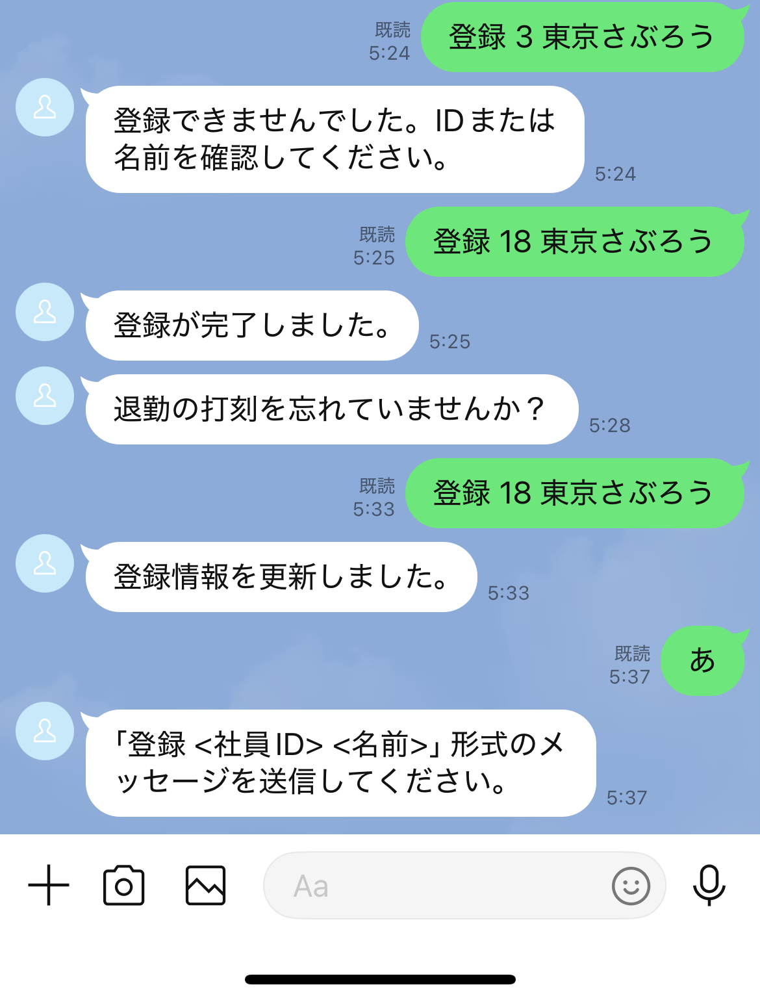

# Attendance System

## プロジェクト概要

**Attendance System** は、勤怠情報の記録・管理、給与計算、社会保険料の計算ができるWebアプリケーションです。

---

## 主な機能

- 出退勤・休憩の打刻機能
- 勤務記録の修正申請と承認フロー
- 給与計算（月給・手当・控除）
- 健康保険料および年金保険料の年度別計算
- 管理者・従業員それぞれの専用ページ
- LINE Botとのユーザー連携機能
- 出勤時に設定した時間が過ぎても退勤が打刻されていない場合、LINE経由で自動通知

---

> ここからアクセスできます：[https://attendance.t2469.com](https://attendance.t2469.com)

## ログイン情報（テスト用）

### 管理者アカウント

```
Email:    tokyo_admin@example.com
Password: password
```

### 従業員アカウント

```
Email:    tokyo_user@example.com
Password: password
```

---

## LINE Bot連携

通知例（打刻忘れ）  


---

## 管理者ダッシュボード

画面右上のアイコンから管理者ページへアクセス可能です。  


---

## 使用技術

| 分類          | 技術・ツール                                                        |
|-------------|---------------------------------------------------------------|
| **フロントエンド** | React, TypeScript, Tailwind CSS, shadcn/ui, Vite              |
| **バックエンド**  | Go (Gin Framework, GORM), PostgreSQL                          |
| **インフラ**    | Docker, Docker Compose                                        |
| **クラウド環境**  | AWS (S3, CloudFront, ECS [Fargate], ALB, NATインスタンス[EC2], RDS) |
| **IaC**     | Terraform                                                     |
| **認証**      | JWT認証（Cookieベース）                                              |
